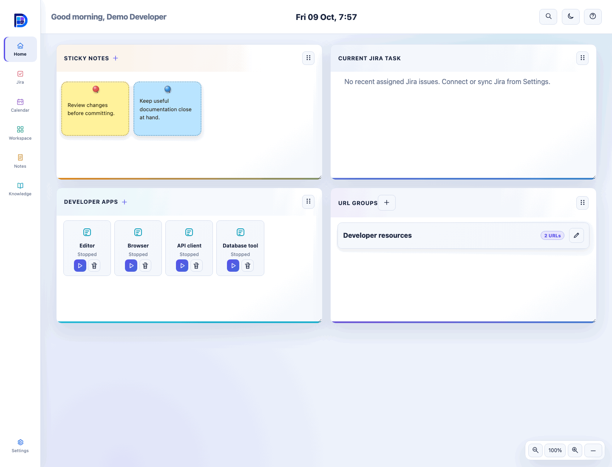

# DevDashboardV1

  

A local-first developer dashboard for VS Code on Windows, macOS, and Linux.

## Install and open

Install [DevDashboardV1 from the Visual Studio Marketplace](https://marketplace.visualstudio.com/items?itemName=BrahmaByte.devdashboardv1).
Click the Activity Bar icon, or run **DevDashboardV1: Open DevDashboardV1**
from the Command Palette. The dashboard opens in the editor area.

A short tour appears on first use. Reopen it with the header's question-mark
button. After an update, **What's new** highlights the changes once; use Skip
or Escape to dismiss it.

## Version 0.1.14

- Local Calendar with Day, Week, Month and Year planning.
- Track holidays and fractional-day leave with annual allowances; legacy hour
  records retain their units.
- Choose custom colors; Year highlights occupied dates and lists month entries.

## Screenshots

Still images: [Home light](assets/screenshots/home-light.png) ·
[Home dark](assets/screenshots/home-dark.png) · [Notes](assets/screenshots/notes.png) ·
[Jira](assets/screenshots/jira-reader.png) · [Confluence](assets/screenshots/knowledge.png) ·
[Settings](assets/screenshots/settings.png).

## Home

Home contains:

- **Sticky notes:** create a note with the plus icon, then click a sticky to view,
  edit, recolor, or delete it.
- **Current Jira task:** your five most recently updated assigned issues,
  including completed work. Click one to open the board with that issue highlighted.
- **URL groups:** save a named set of frequently used HTTPS links.
- **Developer apps:** add an application with the native picker, launch it, see
  whether a dashboard-started instance is running, and close that instance after
  confirmation. Apps appear in a grid with their installed icon when available.

On macOS, apps open through the system application launcher. An app already
running is brought forward; its close action stays disabled to protect sessions
opened outside the dashboard. Closing a dashboard-started app updates its tile
to Stopped once it exits.

Hover over or focus a URL-group name to show its URLs. Select an individual URL
to open it, or use the open-all icon to launch the complete group in your default
browser. Every icon includes a hover description.
Use a group's edit icon to change its name or links; save with the check icon.
Failed saves keep your draft available for correction.

Recent Jira work refreshes when you open Home or sync Jira, independently of the
board's filter. If a selected issue is outside that filter, the board temporarily
shows it with a label without replacing your saved JQL. A failed refresh shows
the last session's results with a warning.

Application paths stay in the local database and are never sent to the dashboard
Webview. DevDashboardV1 tracks and closes only instances that it launched; it does
not scan for or terminate unrelated system processes.

## Jira

The Jira page presents work in **To Do**, **In Progress**, and **Done** columns.

- Enter JQL in the filter field and apply it with the check icon. The last
  successful filter is restored automatically.
- Search the loaded board by issue key or summary. Open **Filter** to select
  Parent, Assignee, Status, Work type or Labels; **Clear all** resets these
  board filters without changing your saved JQL.
- Use the sync icon to refresh Jira on demand while retaining the saved filter.
- Select an issue for a full-screen viewer with formatted details and comments.
  Load more comments, refresh the thread, or open it in your default browser.
  New comments require confirmation in VS Code and Jira Add Comments permission.
- Add local-only cards at the bottom of the board. These cards stay on your
  computer and are never sent to Jira.

## Calendar

The **Planner** switches between Day, Week, Month and Year, with **Quick plan** alongside it. Select a date to plan that day, or select an entry to edit or delete it. Year highlights occupied dates in their colors and lists entries below each month; holidays have dashed outlines.

Choose **Holiday** for an inclusive date range and pick its color (gold by default). In **Leave manager**, set a name, optional **Annual type count** and color. New types use days; record **0.5** for half-day leave. Existing hour-based types retain their units. The **Leave balances** table shows annual count, availed and remaining for the selected year. Editing or deleting leave recalculates balances. Allowances repeat each year without carryover; weekends and holidays are not deducted automatically. Split overnight plans or cross-year leave into separate entries.

Calendar entries stay in your local database and are included in its snapshots; they do not sync to external calendars.

## Workspace

Use Workspace to manage local development tools:

- **Projects:** select folders with the VS Code folder picker, view the current
  Git branch, and open a VS Code terminal in a project.
- **GitHub repositories:** configure a GitHub.com PAT in Settings, refresh, and
  select your account or an organization. Search loaded repositories or use
  **Load more**. The clone icon opens a folder picker and confirmation; successful
  clones are added to **Project launcher**. Git and workspace trust are required.
  The PAT needs repository metadata access and Contents read permission for
  private clones; organization SSO/admin policies may restrict results. Credentials
  remain in VS Code SecretStorage. Native Git uses its own proxy/credential settings.
- **Command shortcuts:** save a command with an optional terminal folder. Running
  it opens a visible VS Code terminal and requires confirmation when appropriate.
- **User environment:** search by variable name (up to 50 matches; values stay
  hidden). Use plus or edit, then enter a non-secret name and masked value in
  native VS Code prompts. Choose overwrite or append and confirm persistence.
  PATH append adds `;` on Windows or `:` on macOS/Linux; other variables append
  the exact entered text. Old saved profile references remain in a collapsed list.

Persistent edits require a trusted workspace and affect only your user, never
machine settings. Windows writes the User environment registry. macOS/Linux use
the supported user shell's startup file: `.zshenv`, or Bash's existing
`.bash_profile`/`.bash_login`, otherwise `.profile` (also sh/dash/ksh).
These are **future shell sessions, not a universal GUI-app environment**.
Existing processes retain old values; fully restart VS Code or sign out/in as
needed. Later shell configuration can override startup values. Unmanaged Unix
variables append to VS Code's inherited value; existing managed entries append
to their saved value. Search includes inherited names and simple user-file assignments.

OS environment values are plaintext—never use this for credentials. Common
credential names and startup/security hooks are blocked. Values never enter the
dashboard, database, settings or logs. Symlinked, oversized, non-UTF-8, foreign-owned
and externally changed startup files are rejected; custom ZDOTDIR and other shells
require manual setup. OS changes remain after uninstall and are not included in
database snapshots. Remove the marked file block or Windows user entry manually
to undo. Native file updates restrict permissions to the current user.

Command text is preserved exactly, including repeated spaces.

## Notes

Notes are stored locally and save automatically while you type.

Updating the extension preserves your saved notes, bookmarks, and project folders.

- Use the plus icon above the notes list to create a note.
- Search notes from the left column.
- Select a note to view or edit it.
- Use the delete icon in the editor header to remove the selected note.

Confluence bookmarks appear as structured reference cards with actions to open
the page in Focus Reader or your default browser.
Saved references remain usable after other searches, cache expiry and restart.
Configure the bookmark's original Confluence site in Settings; Focus Reader needs
its API credential, while opening the saved browser link does not.

## Knowledge

Knowledge provides a two-column Confluence browser:

Previously opened pages load from a five-minute session cache (up to five pages,
24 MB). Refresh Confluence in Settings to discard it and retrieve fresh content.
Page bodies and images are never cached on disk.

Search matches titles, page text and labels across pages you can access. Suggestions
appear after a short typing pause; press Enter to search immediately. Repeated
searches use a one-minute session cache. Formatted text appears first, while images
and diagrams load in parallel.

1. Search for a Confluence page in the left column.
2. Select a result to read its formatted content in the right pane. The header
   shows its space, version, authors, dates, status, and labels when available.
3. Use the reader icon for a full-screen, distraction-free view with a generated
   table of contents.
4. Use the bookmark icon to save the page as a local note reference.
5. Use the external-open icon to open the original page in your default browser.

Images and static diagrams appear in both reading views. Unavailable or blocked
media is clearly identified; use the external-open icon for active macros or
unsupported embeds. Page bodies and images are loaded on selection and are not
cached on disk. Focus Reader includes the same metadata and a table of contents.

## Global search

Use the search icon in the header or:

- `Ctrl+Alt+K` on Windows and Linux
- `Cmd+Alt+K` on macOS

Search covers local notes, projects, command shortcuts, cached Jira issues, and
cached Confluence page metadata.

## Data safety

Database saves use flushed temporary files and atomic replacement. Before a
changed save, an automatic snapshot preserves the previous database at most once
per hour; migrations and restores also save a copy first. The latest **10
snapshots total** are retained alongside `workspace.sqlite` in the generic
`brahmabyte.localdata/snapshots` folder under VS Code's global storage.

- Run **DevDashboardV1: Create database snapshot** before important changes.
- Run **DevDashboardV1: Restore database snapshot**, choose a copy and confirm.
  **Close other VS Code windows using the extension first.** Restore checks the
  checksum, SQLite integrity, relationships and schema before replacing data,
  saves a pre-restore copy, then reloads VS Code. If startup fails, a recovery
  prompt offers the same validated restore. Newer unsupported schemas are rejected.

Snapshots contain private local data, including notes and cached provider metadata;
they are **not encrypted**. SecretStorage credentials and VS Code settings/layout
are not backed up or restored; reconnect providers if needed. Disconnecting a
provider does not erase older snapshots. Each database/snapshot is limited to
128 MiB. Checksums detect accidental damage, not malicious modification.
These same-disk copies do not protect against disk loss: keep an IT-approved
encrypted backup of the folder, including the `.sha256` files, separately.

## Settings and Atlassian connections

Open Settings with the icon at the bottom of the navigation rail. Enter the Jira
or Confluence product root URL, not a board, project, space, or page URL.

For Atlassian Cloud:

1. Enter the `atlassian.net` product URL.
2. Enter your Atlassian account email in the VS Code prompt.
3. Enter an Atlassian API token in the masked prompt.

For Jira or Confluence Data Center:

1. Enter the HTTPS product root URL.
2. Enter a personal access token in the masked VS Code prompt.

Credentials are stored in VS Code SecretStorage and are never sent to the
dashboard Webview or written to the local database. Disconnecting removes the
stored credential and cached provider metadata.

Saved extension-only proxy settings remain active across updates, including older
configurations. If no custom proxy is saved, networking delegates to VS Code.
To switch to VS Code-managed networking, select **Settings → Network proxy →
Use VS Code proxy (default)**. This delegates PAC/bypass rules and supported
authentication negotiation to VS Code. The picker can open VS Code proxy settings;
it never changes global network settings automatically. Authentication support
depends on your VS Code version, OS and corporate policy.

If VS Code's proxy does not work, use **Settings → Network proxy** to configure
an extension-only HTTP/HTTPS proxy. For Basic authentication, enter your
IT-provided proxy username and password in the VS Code prompts, not your Jira
or Confluence credentials. Leave the username empty if authentication is not
required. Credentials are stored in SecretStorage. You can select an IT-approved
PEM CA bundle for corporate TLS certificates. Certificate verification stays on.
The override affects only Jira and Confluence, takes effect on the next request,
and never falls back to a direct connection. Select **Use VS Code proxy (default)**
to remove it. Other extensions and VS Code settings are unchanged.

## Appearance and layout

- The header greets you using your connected Jira display name and shows local time.
- Use the floating bottom-right zoom widget to scale from 80% to 150%; minimize
  it with the minus icon and expand with the plus icon. Click the percentage
  to reset. `Ctrl/Cmd` with `+`, `-`, or `0` and `Ctrl/Cmd` + wheel also work when
  the dashboard has focus. VS Code may handle its own global zoom shortcuts.
- Use the header theme icon to switch between light and dark mode.
- Resize cards from their lower-right edge.
- Home and Settings cards start at consistent sizes unless you saved a manual resize.
- Drag cards with the grip icon, or focus the grip and use the arrow keys, to
  rearrange them.
- Theme, zoom, and card layout are restored when the dashboard is reopened.
- Window resizing temporarily constrains cards without replacing saved sizes.

## Troubleshooting

- **Open command is missing:** confirm the extension is installed, then reload VS Code.
- **Jira or Confluence authentication fails:** confirm the product root URL,
  token type, and browse/view permissions.
- **Jira or Confluence is blocked by a corporate network:** connect the required
  VPN, then use **Open Proxy Settings** from the error message. DevDashboardV1
  uses VS Code's proxy, proxy authentication, and trusted system certificates;
  reload VS Code after changing managed proxy settings.
  Alternatively, configure **Settings → Network proxy** for this extension only.
- **Proxy connection diagnostics:** open **View → Output**, select
  **DevDashboardV1 Network**, then retry connecting, syncing Jira, or refreshing
  Confluence. Logs show network mode, HTTP status, elapsed time and safe
  DNS/TLS/proxy/timeout hints. URLs, credentials, headers and page content are
  omitted. Cached pages do not trigger network logs.
  **Proxy CONNECT HTTP 403** indicates proxy access policy, **3xx** may indicate
  a corporate sign-in redirect, **407** indicates proxy authentication, and
  **502/504** indicate a proxy/upstream failure, not a user cancellation; they
  do not establish whether routing, authentication, DNS or server availability
  caused it. Compare the failing route with the working browser or VS Code route.
  The extension-only proxy supports Basic authentication; use VS Code's managed
  proxy for corporate NTLM/Kerberos/SSO authentication.
- **A project or terminal folder is rejected:** select it with the provided VS
  Code folder picker instead of typing a path.
- **A command does not run:** save it first and approve the VS Code confirmation
  prompt. Multiline commands are rejected.
- **The dashboard stops responding:** run **Developer: Reload Window** and reopen
  DevDashboardV1.
