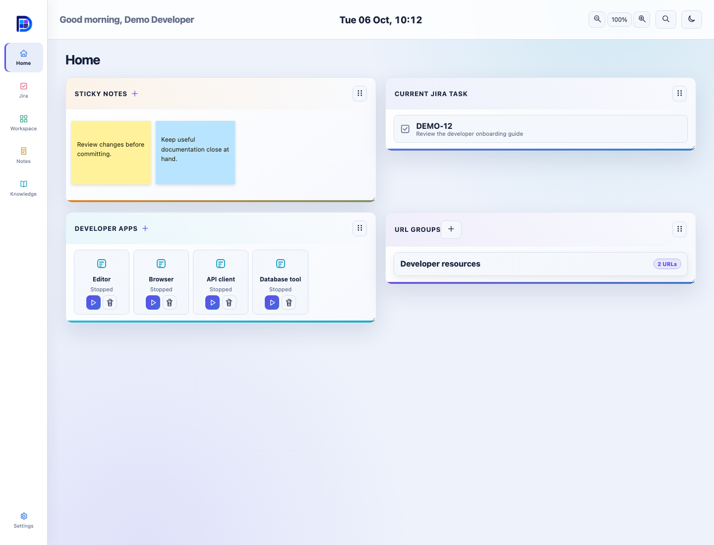
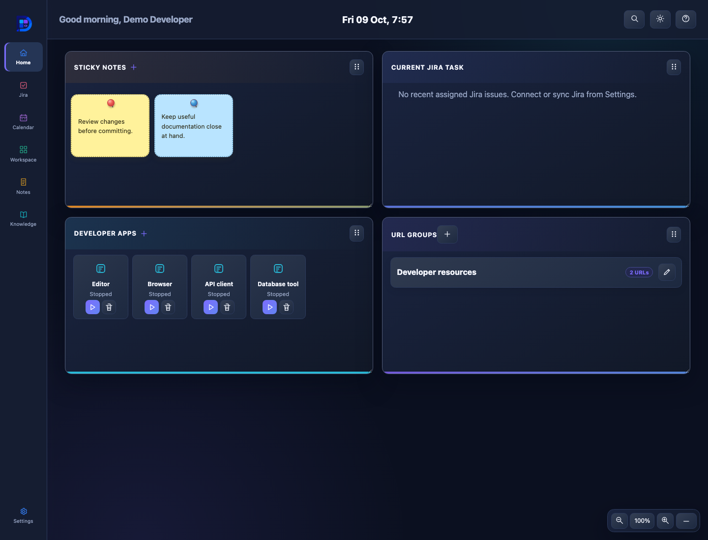
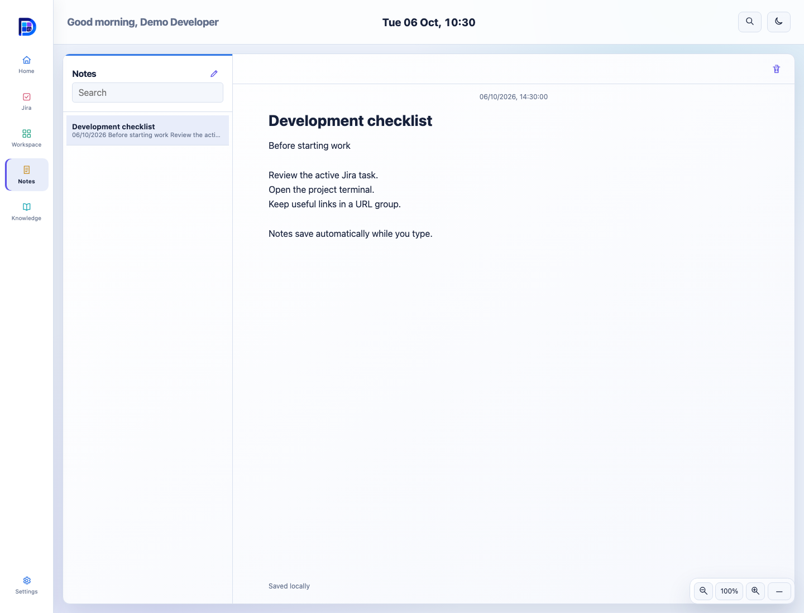

# DevDashboardV1

  

A local-first developer dashboard for VS Code on Windows, macOS, and Linux.

## Install and open

1. Open **Extensions** in VS Code and search for **DevDashboardV1** by **BrahmaByte**.
2. Select **Install**, or visit the
   [Visual Studio Marketplace](https://marketplace.visualstudio.com/items?itemName=BrahmaByte.devdashboardv1).
3. Open the Command Palette and run **DevDashboardV1: Open DevDashboardV1**.

You can reopen the dashboard at any time with the same command.

For manual installation, run **Extensions: Install from VSIX…**, select
`devdashboardv1.vsix`, and reload VS Code.

## Version 0.1.5

- Added the compact Developer apps launcher with installed icons and running status.
- Fixed macOS app launching and false errors after successfully closing an app.
- Improved Jira syncing and issue details, and corporate proxy connectivity.

## Screenshots

Current extension UI with illustrative sample data; no personal or corporate data.

### Home — light mode

### Home — dark mode

### Notes

## Home

Home contains:

- **Sticky notes:** create a note with the plus icon, then click a sticky to view,
  edit, recolor, or delete it.
- **Current Jira task:** opens the Jira board when selected.
- **URL groups:** save a named set of frequently used HTTPS links.
- **Developer apps:** add an application with the native picker, launch it, see
  whether a dashboard-started instance is running, and close that instance after
  confirmation. Apps appear in a grid with their installed icon when available.

On macOS, apps open through the system application launcher. An app already
running is brought forward; its close action stays disabled to protect sessions
opened outside the dashboard. Closing a dashboard-started app updates its tile
to Stopped once it exits.

Hover over or focus a URL-group name to show its URLs. Select an individual URL
to open it, or use the open-all icon to launch the complete group in your default
browser. Every icon includes a hover description.

Application paths stay in the local database and are never sent to the dashboard
Webview. DevDashboardV1 tracks and closes only instances that it launched; it does
not scan for or terminate unrelated system processes.

## Jira

The Jira page presents work in **To Do**, **In Progress**, and **Done** columns.

- Enter JQL in the filter field and apply it with the check icon. The last
  successful filter is restored automatically.
- Use the sync icon to refresh Jira on demand while retaining the saved filter.
- Select an issue to view unified metadata and a formatted description, or open
  it in your default browser.
- Add local-only cards at the bottom of the board. These cards stay on your
  computer and are never sent to Jira.

## Workspace

Use Workspace to manage local development tools:

- **Projects:** select folders with the VS Code folder picker, view the current
  Git branch, and open a VS Code terminal in a project.
- **Command shortcuts:** save a command with an optional terminal folder. Running
  it opens a visible VS Code terminal and requires confirmation when appropriate.
- **Environment profiles:** save environment-variable names for reference. Secret
  values are not stored.

Command text is preserved exactly, including repeated spaces.

## Notes

Notes are stored locally and save automatically while you type.

- Use the plus icon above the notes list to create a note.
- Search notes from the left column.
- Select a note to view or edit it.
- Use the delete icon in the editor header to remove the selected note.

Confluence bookmarks appear as structured reference cards with actions to open
the page in Focus Reader or your default browser.

## Knowledge

Knowledge provides a two-column Confluence browser:

1. Search for a Confluence page in the left column.
2. Select a result to read its formatted content in the right pane. The header
   shows its space, version, authors, dates, status, and labels when available.
3. Use the reader icon for a full-screen, distraction-free view with a generated
   table of contents.
4. Use the bookmark icon to save the page as a local note reference.
5. Use the external-open icon to open the original page in your default browser.

Images and static diagrams appear in both reading views. Unavailable or blocked
media is clearly identified; use the external-open icon for active macros or
unsupported embeds. Page bodies and images are loaded on selection and are not
cached on disk. Focus Reader includes the same metadata and a table of contents.

## Global search

Use the search icon in the header or:

- `Ctrl+Alt+K` on Windows and Linux
- `Cmd+Alt+K` on macOS

Search covers local notes, projects, command shortcuts, cached Jira issues, and
cached Confluence page metadata.

## Settings and Atlassian connections

Open Settings with the icon at the bottom of the navigation rail. Enter the Jira
or Confluence product root URL, not a board, project, space, or page URL.

For Atlassian Cloud:

1. Enter the `atlassian.net` product URL.
2. Enter your Atlassian account email in the VS Code prompt.
3. Enter an Atlassian API token in the masked prompt.

For Jira or Confluence Data Center:

1. Enter the HTTPS product root URL.
2. Enter a personal access token in the masked VS Code prompt.

Credentials are stored in VS Code SecretStorage and are never sent to the
dashboard Webview or written to the local database. Disconnecting removes the
stored credential and cached provider metadata.

If VS Code's proxy does not work, use **Settings → Network proxy** to configure
an extension-only HTTP/HTTPS proxy. Optional Basic proxy credentials are entered
in VS Code prompts and stored in SecretStorage. You can select an IT-approved
PEM CA bundle for corporate TLS certificates. Certificate verification stays on.
The override affects only Jira and Confluence, takes effect on the next request,
and never falls back to a direct connection. Select **Use VS Code proxy (default)**
to remove it. Other extensions and VS Code settings are unchanged.

## Appearance and layout

- Use the header theme icon to switch between light and dark mode.
- Resize cards from their lower-right edge.
- Drag cards with the grip icon, or focus the grip and use the arrow keys, to
  rearrange them.
- Theme and card layout are restored when the dashboard is reopened.

## Troubleshooting

- **Open command is missing:** confirm the extension is installed, then reload VS Code.
- **Jira or Confluence authentication fails:** confirm the product root URL,
  token type, and browse/view permissions.
- **Jira or Confluence is blocked by a corporate network:** connect the required
  VPN, then use **Open Proxy Settings** from the error message. DevDashboardV1
  uses VS Code's proxy, proxy authentication, and trusted system certificates;
  reload VS Code after changing managed proxy settings.
  Alternatively, configure **Settings → Network proxy** for this extension only.
- **A project or terminal folder is rejected:** select it with the provided VS
  Code folder picker instead of typing a path.
- **A command does not run:** save it first and approve the VS Code confirmation
  prompt. Multiline commands are rejected.
- **The dashboard stops responding:** run **Developer: Reload Window** and reopen
  DevDashboardV1.
